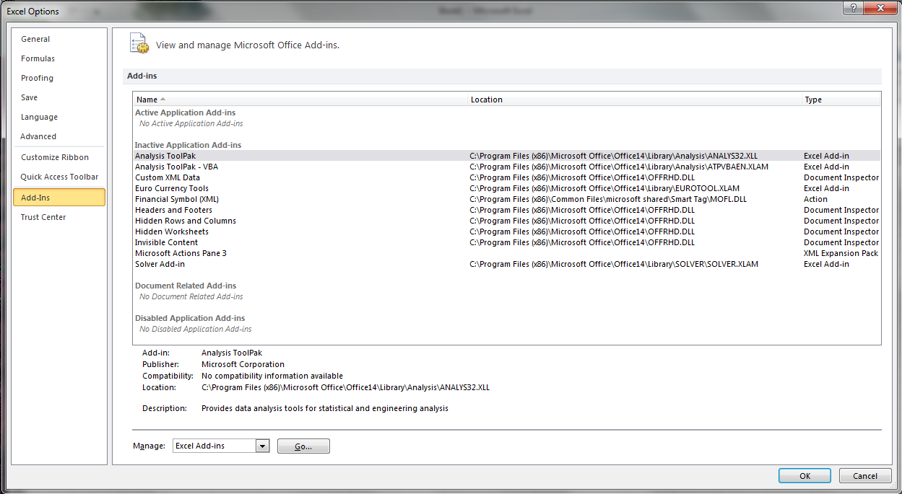

:authors:
    Denis Barbier,
    Louis Blanchard,
    Lahcen Boulaajine
:organization: IMACS
:date: 2015-09-15

======================================
OpenTURNS integration in Excel add-ins
======================================

This document describes a simple Excel add-in written to demonstrate how to call OpenTURNS functions from Excel.
This work has been funded by Airbus Group Innovations, and all material is placed under the same copyright as
OpenTURNS, except for the FRAMEWRK code released by Microsoft in Excel SDK.

Compilation from sources
========================

Prerequisites
-------------

Excel SDK
^^^^^^^^^

Download Excel SDK from Microsoft's site, either
`Excel 2010 SDK <http://www.microsoft.com/en-us/download/details.aspx?id=20199>`_
or
`Excel 2013 SDK <http://www.microsoft.com/en-us/download/details.aspx?id=35567>`_, and launch the installer.

OpenTURNS
^^^^^^^^^

Download OpenTURNS 1.6 from sourceforge site. If your Excel application is 32bit, download
`x86 version <http://sourceforge.net/projects/openturns/files/openturns/openturns-1.6/dev/openturns-1.6-vs2010-x86.zip/download>`_
and if it is 64bit, download
`x86_64 version <http://sourceforge.net/projects/openturns/files/openturns/openturns-1.6/dev/openturns-1.6-vs2010-x86_64.zip/download>`_.
Unzip on your disk, for instance at ``C:\OpenTURNS``.

Build instructions
------------------

Click on ``otxll_simple_example.sln`` to launch Microsoft Visual Studio.  You may have to change paths to headers
and libraries

in order to find OpenTURNS and Excel SDK files.
Then generate ``otxll_simple_example`` project, this creates file ``Release\otxll_simple_example.xll``.

Excel Add-in installation
=========================

The XLL file compiled in previous section is in fact a true Dynamic Link Library (DLL), and it depends on ``OT.dll``, and more generally on all libraries found under the ``bin`` directory of OpenTURNS archive.  Thus Excel will have to find these files when loading ``otxll_simple_example.xll``.  A common solution is to put all dependent files into the same directory as ``otxll_simple_example.xll``.  Unfortunately this will not work here; it seems that the only way to properly install ``otxll_simple_example.xll`` add-in is to add the ``bin`` directory to the ``PATH`` environment variable before launching Excel.  This can either be done interactively (but requires administrator privileges) or by a script:

.. code-block:: batch

  set PATH=C:\OpenTURNS\openturns-1.6-vs2010-x86\bin;%PATH%
  "C:\Program Files (x86)\Microsoft Office\Office14\EXCEL.exe"

Write these lines (path to OpenTURNS and Excel may have to be adjusted) into a batch file, say ``setXLLPath.bat`` for instance, and now double-click on it from file explorer.

Then click on ``File->Options``

Select ``Add-Ins`` on the left menu, then ``Excel Add-ins`` in the bottom drop-down menu, and click on ``Go...`` button:

Click on ``Browse``:

and navigate to find ``otxll_simple_example.xll``.  The XLL is then displayed and selected, and finish by clicking on ``OK`` button:

Excel does not complain if there is an error during XLL loading, the only way to check whether XLL has been successfully loaded is to see if new functions are available.  In order to be more user-friendly, a notice message has been added if XLL has been successfully loaded:

Excel Add-in usage
==================

Functions defined in XLL can then be called either directly from a formula

or from Excel Function Wizard

Arguments can then be filled-in from dialog box, and argument usage is provided to users

In either case, cell now contains a formula calling our OpenTURNS function ``OT_NORMAL_PDF``.

Of course, arguments can also be provided as references to cells:

Quick guide to develop Excel add-ins
====================================

There are two distinct Excel APIs, a newer one appeared in Excel 2007. New functions have a ``12`` suffix, as Excel 2007 is in fact Excel 12.  There are two examples in Excel SDK, we use them as a starting point.

We define the following functions:

  +----------------------------+-----------------------------------------------------------------+
  | Function name              | Description                                                     |
  +============================+=================================================================+
  | ``xlAddInManagerInfo12``   | Called when Add-In manager is called the first time, so that XLL|
  |                            | specific so that XLL specific informations (for instance its    |
  |                            | description) can be passed to the Add-In manager                |
  +----------------------------+-----------------------------------------------------------------+
  | ``xlAutoOpen``             | Called when XLL is loaded, either when Excel is launched or on  |
  |                            | user's request.  This function should register all the exported |
  |                            | functions, add menus, and perform any initialization required   |
  |                            | by the XLL.                                                     |
  |                            | This function is mandatory, all other functions are optional    |
  +----------------------------+-----------------------------------------------------------------+
  | ``xlAutoClose``            | Called when XLL is deactivated, either when Excel is closed or  |
  |                            | on user's request.  This function should perform a global       |
  |                            | cleanup, except that registered functions are automatically     |
  |                            | unregistered by Excel                                           |
  +----------------------------+-----------------------------------------------------------------+
  | ``xlAutoAdd``              | Called when XLL is activated by using the the Add-In manager    |
  +----------------------------+-----------------------------------------------------------------+
  | ``xlAutoRemove``           | Called when XLL is deactivated by using the the Add-In manager  |
  +----------------------------+-----------------------------------------------------------------+
  | ``xlAutoRegister12``       | Called by Excel if a macro sheet tries to register a function   |
  |                            | without specifying its signature.                               |
  +----------------------------+-----------------------------------------------------------------+
  | ``xlAutoFree12``           | Called by Excel just after a function returns an ``XLOPER12``   |
  +----------------------------+-----------------------------------------------------------------+

An XLL is a DLL which contains an ``xlAutoOpen`` exported function.  It is created by Microsoft Visual Studio like any other DLL, one only has to change suffix to ``.xll``.  Functions which will be used by Excel must be exported.  This can either be performed by adding ``__declspec(dllexport)`` attribute to function defintion, or by using a so-called Module-Definition file (with a ``.def`` extension).

For instance, this example project uses the following module-definition file:

.. code-block:: C

  ;***************************************************************************
  ; File: ot_simple_example.def
  ;
  ; Purpose: Definition file for ot_simple_example.xll project
  ;***************************************************************************
  
  EXPORTS
      ; Standard XLL functions
      xlAutoOpen
      xlAutoRegister12
      xlAutoClose
      xlAutoAdd
      xlAutoRemove
      xlAddInManagerInfo12
      xlAutoFree12
  
      ; User defined functions
      OT_NORMAL_PDF

All XLL functions are defined in ``xll_functions.cpp``, and ``OT_NORMAL_PDF`` in ``ot_normal_pdf.cpp``.

There is a single data type in Excel C API: ``XLOPER12`` (or ``XLOPER`` for the old API), which is a struct containing an union (in a ``val`` member)
and an ``xltype`` member which defines the type of the union.  Here is a simplified version of its definition, found in ``xlcall.h``:

.. code-block:: C

  typedef struct xloper12
  {
          union
          {
                  double num;               // xltypeNum
                  XCHAR *str;               // xltypeStr
                  BOOL xbool;               // xltypeBool
                  int err;                  // xltypeErr
                  int w;                    // xltypeInt
                  struct { ...  } sref;     // xltypeSRef
                  struct { ...  } mref;     // xltypeRef
                  struct { ...  } array;    // xltypeMulti
                  struct { ...  } flow;     // xltypeFlow
                  struct { ...  } bigdata;  // xltypeBigData
          } val;
          DWORD xltype;
  } XLOPER12, *LPXLOPER12;

Below are usage examples for simple datatypes; ``xltypeSRef``, ``xltypeRef`` and ``xltypeMulti`` are a little bit more complicated.

.. code-block:: C

  XLOPER12 x, y, z;
  // Cell containing a double
  x.xltype = xltypeNum;
  x.val.num = 0.3;
  // Cell containing an int
  y.xltype = xltypeInt;
  y.val.w = 4;
  // Cell containing a string
  z.xltype = xltypeStr;
  z.val.str = L"\020This is a string";

As Excel had first been written in Pascal, it does not use standard C null-terminated strings, but strings prefixed by their length (in octal notation).
Having to transform C strings into Pascal strings is inconvenient and error prone, thus several tools exist to do that automatically.  For instance, Excel SDK comes with a ``FRAMEWRK`` library which implements several helper functions.  Most opensource projects define their own utility functions, but we decided to use ``FRAMWRK``.
Previous definition are then rewritten as:

.. code-block:: C

  LPXLOPER12 px, py, pz;
  // Cell containing a double
  px = TempNum12(0.3);
  // Cell containing an int
  py = TempInt12(4);
  // Cell containing a string
  pz = TempStr12("This is a string");

User-defined functions must be made available to Excel by registering them in ``xlAutoOpen``.  For convenience, they are stored in
an array in ``xll_functions.cpp``, because the list of functions has to be accessed within other ``xlAuto*``
functions:

.. code-block:: C

  #define rgWorksheetFuncsRows 4
  #define rgWorksheetFuncsCols 13

  LPWSTR rgWorksheetFuncs[rgWorksheetFuncsRows][rgWorksheetFuncsCols] =
  {
      { L"OT_NORMAL_PDF",      // Name of the function in DLL
        L"UUUU",               // Data type of the return value and arguments
          // Most common values are B (double, passed by value) and
          // U (XLOPER12 values, arrays, and range references
        L"OT_NORMAL_PDF",      // The function name as it will appear in the Function Wizard
        L"Mu, Sigma, Point",   // Description of arguments
        L"1",                  // Macro type, use "1" by default or "2" for hidden commands
        L"Openturns Add-In",   // Category name
        L"",                   // Shortcut for commands, do not use
        L"",                   // Reference to the Help file
        L"Compute the probability density function",        // Function help
        L"Mean of the Gaussian distribution",               // Description of first argument
        L"Standard deviation of the Gaussian distribution", // Description of second argument
        L"Point where PDF is evaluated"                     // Description of third argument
      },
      { L"OT_NORMAL_PDF_ARRAY",
        L"UUUU",
        L"OT_NORMAL_PDF_ARRAY",
        L"Mu, Sigma, Array",
        L"1",
        L"Openturns Add-In",
        L"",
        L"",
        L"Compute the probability density function on a cell selection",
        L"Mean of the Gaussian distribution",
        L"Standard deviation of the Gaussian distribution",
        L"Cells containing points where PDF is evaluated"
      },
  [...two more function definitions stripped away...]
  };

And here is how this array is used by ``xlAutoOpen``:

.. code-block:: C

    for (i=0; i<rgFuncsRows; ++i)
    {
        Excel12f(xlfRegister, 0,  1 + rgFuncsCols,
                 &xDLL,
                 TempStr12(rgWorksheetFuncs[i][0]),
                 TempStr12(rgWorksheetFuncs[i][1]),
                 TempStr12(rgWorksheetFuncs[i][2]),
                 TempStr12(rgWorksheetFuncs[i][3]),
                 TempStr12(rgWorksheetFuncs[i][4]),
                 TempStr12(rgWorksheetFuncs[i][5]),
                 TempStr12(rgWorksheetFuncs[i][6]),
                 TempStr12(rgWorksheetFuncs[i][7]),
                 TempStr12(rgWorksheetFuncs[i][8]),
                 TempStr12(rgWorksheetFuncs[i][9]),
                 TempStr12(rgWorksheetFuncs[i][10]),
                 TempStr12(rgWorksheetFuncs[i][11])
                 );
    }

The ``xlfRegister`` function accepts a varying number of arguments, and this number is passed as the third argument of ``Excel12f``.  Here is a description of the first arguments:

  +-------------------------------+------------------------+---------------------------------------------------------+
  | Example Usage                 | Argument  Name         | Description                                             |
  +===============================+========================+=========================================================+
  | L"OT_NORMAL_PDF"              | pxProcedure            | The name of the function to call as it                  |
  |                               |                        | appears in the DLL code                                 |
  +-------------------------------+------------------------+---------------------------------------------------------+
  | L"UUUU"                       | pxTypeText             | Function signature, see below                           |
  +-------------------------------+------------------------+---------------------------------------------------------+
  | L"OT_NORMAL_PDF"              | pxFunctionText         | The function name as it will appear in                  |
  |                               |                        | the Function Wizard                                     |
  +-------------------------------+------------------------+---------------------------------------------------------+
  | L"Mu, Sigma, Point"           | pxArgumentText         | An optional text string that describes                  |
  |                               |                        | arguments                                               |
  +-------------------------------+------------------------+---------------------------------------------------------+
  | L"1"                          | pxMacroType            | An optional argument that indicates the                 |
  |                               |                        | type of XLL entry point (always use "1")                |
  +-------------------------------+------------------------+---------------------------------------------------------+
  | L"Openturns Add-In"           | pxCategory             | An optional argument which is used by                   |
  |                               |                        | the Function Wizard                                     |
  +-------------------------------+------------------------+---------------------------------------------------------+
  | L""                           | pxShortcutText         | A one-character, case-sensitive string                  |
  |                               |                        | that specifies the control key assigned                 |
  |                               |                        | to this command                                         |
  +-------------------------------+------------------------+---------------------------------------------------------+
  | L""                           | pxHelpTopic            | An optional reference to the Help file                  |
  |                               |                        | (.chm or .hlp) to display when the user                 |
  |                               |                        | clicks the Help button                                  |
  +-------------------------------+------------------------+---------------------------------------------------------+
  | L"Compute the probability     | pxFunctionHelp         | An optional string that describes your                  |
  | density function"             |                        | custom function when it is selected in                  |
  |                               |                        | the Function Wizard                                     |
  +-------------------------------+------------------------+---------------------------------------------------------+
  | L"Mean of the Gaussian        | pxArgumentHelp1        | An optional text string that describes                  |
  | distribution"                 |                        | the first argument when the function                    |
  |                               |                        | is selected in the Function Wizard                      |
  +-------------------------------+------------------------+---------------------------------------------------------+
  | L"Standard deviation of       | pxArgumentHelp2        | An optional text string that describes                  |
  | the Gaussian distribution"    |                        | the second argument when the function                   |
  |                               |                        | is selected in the Function Wizard                      |
  +-------------------------------+------------------------+---------------------------------------------------------+
  | ...                           | ...                    | ...                                                     |
  +-------------------------------+------------------------+---------------------------------------------------------+

Function signature encodes the type of return value and arguments.  It consists of several characters, first one describes the return value, others are arguments.

  +-----------------+-----------------------------------------------------------------------------------+
  | Character       | Description                                                                       |
  +=================+===================================================================================+
  | ``A``           | Boolean, by value                                                                 |
  +-----------------+-----------------------------------------------------------------------------------+
  | ``B``           | Double, by value                                                                  |
  +-----------------+-----------------------------------------------------------------------------------+
  | ``C``, ``F``    | Null-terminated ASCII byte string                                                 |
  +-----------------+-----------------------------------------------------------------------------------+
  | ``D``, ``G``    | Counted ASCII byte string                                                         |
  +-----------------+-----------------------------------------------------------------------------------+
  | ``E``           | Double, by reference                                                              |
  +-----------------+-----------------------------------------------------------------------------------+
  | ``H``           | 16-bit WORD, by value                                                             |
  +-----------------+-----------------------------------------------------------------------------------+
  | ``I``           | 16-bit signed integer, by value                                                   |
  +-----------------+-----------------------------------------------------------------------------------+
  | ``J``           | 32-bit signed integer, by value                                                   |
  +-----------------+-----------------------------------------------------------------------------------+
  | ``K``           | Floating-point array structure                                                    |
  +-----------------+-----------------------------------------------------------------------------------+
  | ``L``           | Boolean, by reference                                                             |
  +-----------------+-----------------------------------------------------------------------------------+
  | ``M``           | 16-bit signed integer, by reference                                               |
  +-----------------+-----------------------------------------------------------------------------------+
  | ``N``           | 32-bit signed integer, by reference                                               |
  +-----------------+-----------------------------------------------------------------------------------+
  | ``O``           | Array (of integer or double)                                                      |
  +-----------------+-----------------------------------------------------------------------------------+
  | ``P``           | Variable-type worksheet values and arrays (``XLOPER``)                            |
  +-----------------+-----------------------------------------------------------------------------------+
  | ``Q``           | Variable-type worksheet values and arrays (``XLOPER12``)                          |
  +-----------------+-----------------------------------------------------------------------------------+
  | ``R``           | Values, arrays, and range references (``XLOPER``)                                 |
  +-----------------+-----------------------------------------------------------------------------------+
  | ``U``           | Values, arrays, and range references (``XLOPER12``)                               |
  +-----------------+-----------------------------------------------------------------------------------+

Arguments are passed by value or reference.  This example provides a function to compute the value of the PDF of a Gaussian distribution at a given point.
We could declare our function as being:

.. code-block:: C

  // Arguments and return value passed by value
  // Function signature is "BBBB"
  double OT_NORMAL_PDF(double mu, double sigma, double point);

Excel would then automatically compute arguments if needed, and put return value into the selected cell.
But we decided to always pass arguments by reference instead, because this gives more flexibility.  For instance, we can compute several cells in a single call.

.. code-block:: C

  // Arguments and return value passed by reference
  // Function signature is "UUUU"
  LPXLOPER12 OT_NORMAL_PDF(LPXLOPER12 xl_mu,
                           LPXLOPER12 xl_sigma,
                           LPXLOPER12 xl_point);

The downside is that return value is a newly allocated pointer, and thus Excel must be told how to deallocate it.  Of course it cannot be deleted before being returned to Excel, so there is a memory leak here.  By adding ``xlbitDLLFree`` to its type, as shown just below, we tell Excel to call our ``xlAutoFree12`` function when it does not need this pointer anymore.  This is even more useful for complex structures like ``xltypeStr`` or ``xltypeMulti``.  We must ensure that pointers returned to Excel always use the same allocation scheme (for instance, either all strings are static strings, or all strings are allocated), and ``xlAutoFree12`` frees memory when needed.

Let us now have a look at the full definition of ``OT_NORMAL_PDF``:

.. code-block:: C

  LPXLOPER12 WINAPI
  OT_NORMAL_PDF(LPXLOPER12 xl_mu, LPXLOPER12 xl_sigma, LPXLOPER12 xl_point)
  {
      double mu, sigma, point;
      int error = -1;
  
      // Coerce the mean parameter
      //======================
      if((error = xloper_to_num(xl_mu, &mu)) != -1)
      {
          return dialogError("(OT_NORMAL_PDF): Invalid conversion to xltypeNum for argument 'mu'", error);
      }
  
      // Coerce the standard deviation parameter
      //========================================
      if((error = xloper_to_num(xl_sigma, &sigma)) != -1)
      {
          return dialogError("(OT_NORMAL_PDF): Invalid conversion to xltypeNum for argument 'sigma'", error);
      }
  
      // Coerce the point parameter : to compute the PDF
      //================================================
      if((error = xloper_to_num(xl_point, &point)) != -1)
      {
          return dialogError("(OT_NORMAL_PDF): Invalid conversion to xltypeNum for argument 'point'", error);
      }
  
      double value;
      //Compute the PDF on point
      //========================
      try
      {
          OT::Normal distribution(mu, sigma);
          value = distribution.computePDF(point);
      }
      catch(OT::Exception & e)
      {
          return dialogError(e.what(), xlerrValue);
      }
      catch(std::exception & e)
      {
          return dialogError(e.what(), xlerrValue);
      }
  
      // xlbitDLLFree enables the DLL to release
      // any dynamically allocated memory
      // that was associated with the xloper
      LPXLOPER12 xResult = new XLOPER12();
      xResult->xltype = xltypeNum | xlbitDLLFree;
      xResult->val.num = value;
  
      return xResult;
  }

Excel SDK provides helper functions to transform simple types (int, double, strings, ...) into ``LPXLOPER12`` data type which can be passed to Excel, but surprisingly there are no tools to perform the opposite conversion.  Thus we wrote an ``xloper_to_num`` function for that purpose.  If conversion fails, an ``LPXLOPER12`` with type ``xltypeErr`` is returned to tell Excel that something went wrong.  Likewise, the ``dialogError`` function has been written to help managing errors.

All calls to OpenTURNS functions must be enclosed in a try-catch block.
The first reason is that we do not want to crash Excel if there is a user error.  But there is also a more subtle reason: when user launches the Function Wizard to enter function arguments, Excel calls our function each time an argument has changed.  With the code written above, it would not matter much because arguments are checked, but if they are passed by value like this:

.. code-block:: C

  double WINAPI OT_NORMAL_PDF(double mu, double sigma, double point) {
    return OT::Normal(mu, sigma).computePDF(point);
  }

then Excel calls ``OT_NORMAL_PDF`` with not-yet specified arguments set to ``0.0``, and of course ``OT::Normal`` throws an exception.  We could check arguments, but this is cumbersome, and OpenTURNS already performs these checks for us, so it is much simpler to catch all OpenTURNS exceptions.

Caveats
=======

- Documentation about writing XLL is scarce.

- For security reasons, functions in XLL cannot modify anything in user's worksheet, thus it is not possible to pass the number of cells to replace as an argument (to plot a graph, for instance).  There are few workarounds, but they have also their drawbacks.

- We can only call OpenTURNS functions without side effects; it is likely that XLL should provide an object manager so that OpenTURNS can initialize some heavy objects in a function call, and use it in another function.

- Due to lack of time, we did not manage to write dedicated Help files

Conclusion
==========

This simple example shows that it is very easy to call OpenTURNS functions from Excel.  Most problems we encounter came from Excel, it prevents user-defined functions to overwrite cells, which is of course good for security, but is troublesome for us.  Maybe a mix of VBA and XLL could solve these issues.

